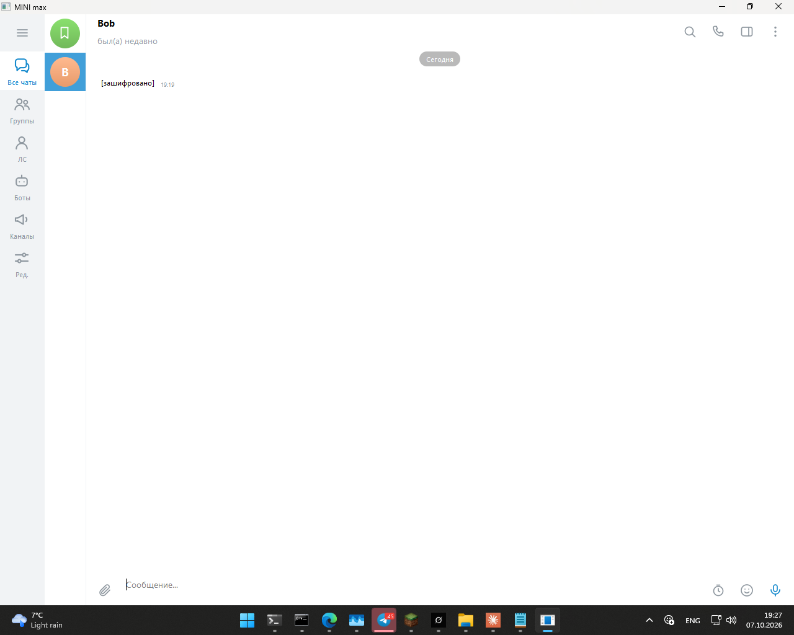
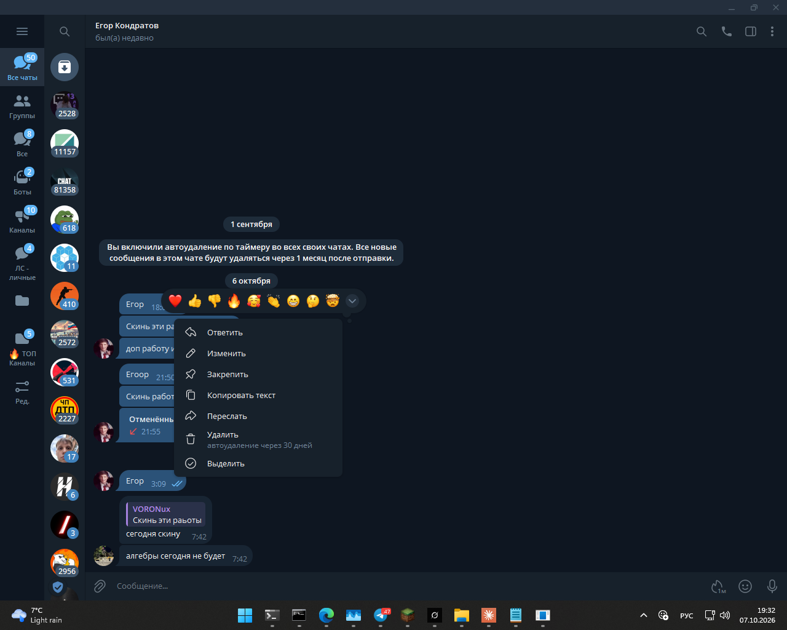
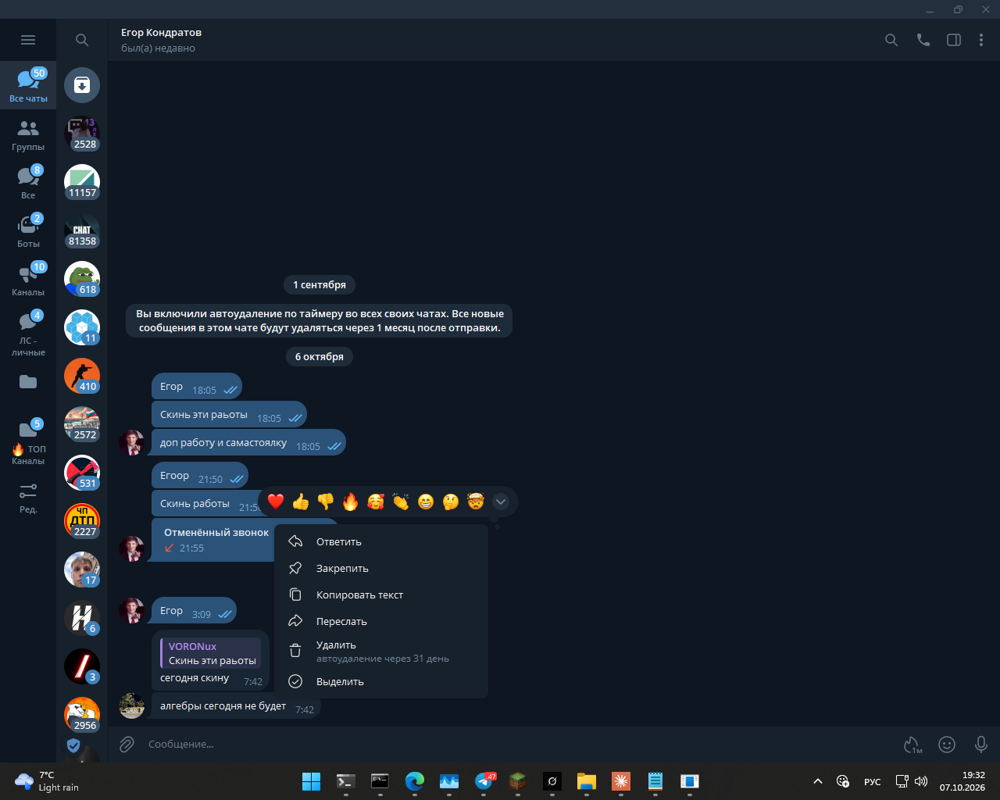
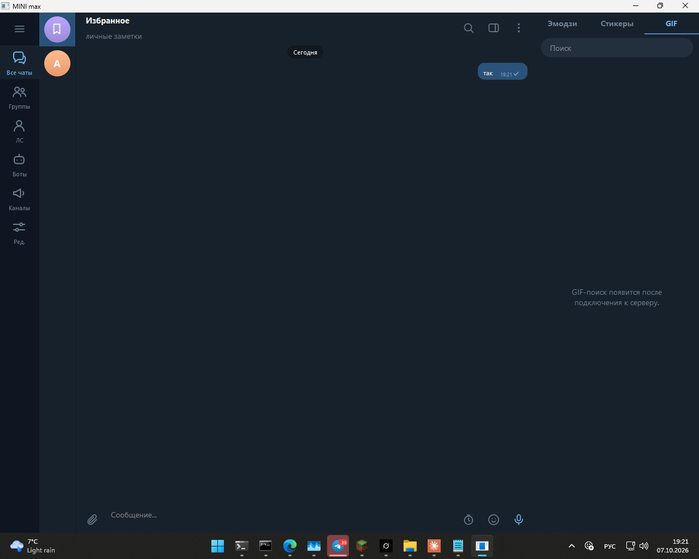

<div align="center">

# 💬 MINI max

### Яркий и удобный мессенджер от Wharner APP

<p>
  <a href="https://github.com/Wharner-APP/MINI-max/releases"><strong>⬇️ Скачать</strong></a> ·
  <a href="https://github.com/Wharner-APP/MINI-max/issues"><strong>🐞 Сообщить об ошибке</strong></a> ·
  <a href="https://github.com/Wharner-APP/MINI-max/actions"><strong>🛠 Сборки</strong></a>
</p>

<p>
  
  
  
  
</p>

</div>

---

> [!WARNING]
> MINI max находится в **alpha**. Часть серверных функций и отдельных возможностей всё ещё развивается.

## 🚀 Быстрый старт

1. Откройте **[Releases](https://github.com/Wharner-APP/MINI-max/releases)**.
2. Скачайте архив для своей системы.
3. Распакуйте его полностью в отдельную папку.
4. Запустите `update.exe` на Windows или `update` на Linux/macOS.

| Платформа | Архив |
|---|---|
| 🪟 Windows 64-bit | `minimaxWinX64.zip` |
| 🐧 Linux 32-bit / i386 | `minimaxLinuxX86.tar.gz` |
| 🍎 macOS Intel 64-bit | `minimaxMacX64.tar.gz` |

> Windows 32-bit и Linux 64-bit сейчас **не собираются и не публикуются**.

## 📡 Нет соединения с сервером?

Первым делом обновите адрес сервера.

Закройте MINI max и найдите:

```text
configs/connect.ip
```

Скачайте самый новый `connect.ip` из актуальной версии клиента или из подготовленного сервером дистрибутива и замените старый файл.

Например:

```text
C:\MINI max\configs\connect.ip
```

Формат файла — одна строка:

```text
https://your-server.example
```

или:

```text
192.168.1.100:8080
```

После замены запустите `update.exe` ещё раз.

## 🧩 Регистрация и hCaptcha

При регистрации MINI max может открыть hCaptcha в браузере:

1. заполните форму регистрации;
2. откройте проверку hCaptcha;
3. пройдите её;
4. вернитесь в MINI max;
5. приложение дождётся подтверждения от сервера.

Если проверка истекла — начните регистрацию заново.

> 🔐 Секрет hCaptcha находится только на сервере и не должен попадать в клиентский архив.

## 🔄 Обновления

`update.exe` — это отдельный обновлятор.

Он получает подписанный `manifest.json`, проверяет Ed25519-подпись и SHA-256 файлов, скачивает только изменившиеся файлы и затем запускает MINI max.

Путь обновлений на сервере:

```text
/update/<platform>/manifest.json
/update/<platform>/manifest.sig
/update/<platform>/files/...
```

## 🎨 Интерфейс

Ниже находятся **актуальные скриншоты текущей версии**, а не старые изображения из предыдущей сборки.

### ☀️ Светлая тема



### 🖱️ Контекстное меню сообщения собеседника



### 🖱️ Контекстное меню собственного сообщения



### 🎞️ Панель GIF



## ✨ Что уже есть в клиенте

- 🔐 авторизация и регистрация;
- 🧩 hCaptcha;
- 🌙 тёмная и ☀️ светлая темы;
- 🎨 настройки оформления;
- 💬 чаты и контекстные действия над сообщениями;
- 🔄 автообновление с подписью;
- 🖼️ аватары и профильные настройки;
- 🎞️ интерфейс GIF/стикеров/эмодзи;
- ⭐ интерфейс Premium, Stars и Gifts;
- 🏢 интерфейс бизнес-функций;
- 📂 папки, архив, закрепления и поиск.

Некоторые функции требуют совместимой серверной реализации и поэтому могут быть доступны не во всех конфигурациях.

## 🧯 MINI max не запускается

Если Windows пишет **«Точка входа в процедуру не найдена»**, не скачивайте случайные DLL из интернета.

Скачайте полный архив заново из официального [Releases](https://github.com/Wharner-APP/MINI-max/releases) и распакуйте его целиком.

Для Windows-архива MINI max runtime MinGW (`libstdc++-6.dll`, `libgcc_s_seh-1.dll`, `libwinpthread-1.dll`) должен соответствовать тому же MinGW, которым был собран клиент.

## 💾 Где хранятся данные?

Клиент имеет локальное хранилище в каталоге данных приложения. Сервер также хранит серверные данные и сообщения, если конкретная функция использует серверную синхронизацию.

`configs/client.toml` — настройки клиента.

`configs/connect.ip` — адрес сервера.

## 🤝 Для пользователей

Если нашли ошибку, откройте **[Issues](https://github.com/Wharner-APP/MINI-max/issues)** и приложите:

- ОС и архитектуру;
- версию MINI max;
- точный текст ошибки;
- скриншот;
- что именно вы делали перед ошибкой.

Не публикуйте пароли, токены и приватные ключи.

## 🧑‍💻 Для разработчиков

Исходный код клиента открыт.

```text
client/      → Qt-клиент
common/      → общие структуры и сетевые пути
updater/     → update/update.exe
tools/       → упаковка и служебные инструменты
configs/     → конфигурация
```

Сборка:

```bash
cmake -S . -B build -G Ninja -DCMAKE_BUILD_TYPE=Release
cmake --build build
ctest --test-dir build
```

GitHub Actions официально собирает только:

```text
Windows x64
Linux i386
macOS Intel x64
```

### hCaptcha

`CaptchaAPI.cfg` содержит публичный site key.

**Secret hCaptcha нельзя хранить в клиентском репозитории, исходниках или готовом клиентском архиве.**

### Автообновление

Публичный ключ `configs/update_public.key` встраивается в клиент, а приватный ключ подписи должен находиться только на сервере.

---

<div align="center">

### 💜 MINI max

**быстро ⚡ • красиво 🎨 • понятно 🧸 • развивается 🚀**

[⬇️ Скачать](https://github.com/Wharner-APP/MINI-max/releases) ·
[🐞 Issues](https://github.com/Wharner-APP/MINI-max/issues) ·
[⭐ GitHub](https://github.com/Wharner-APP/MINI-max)

</div>
