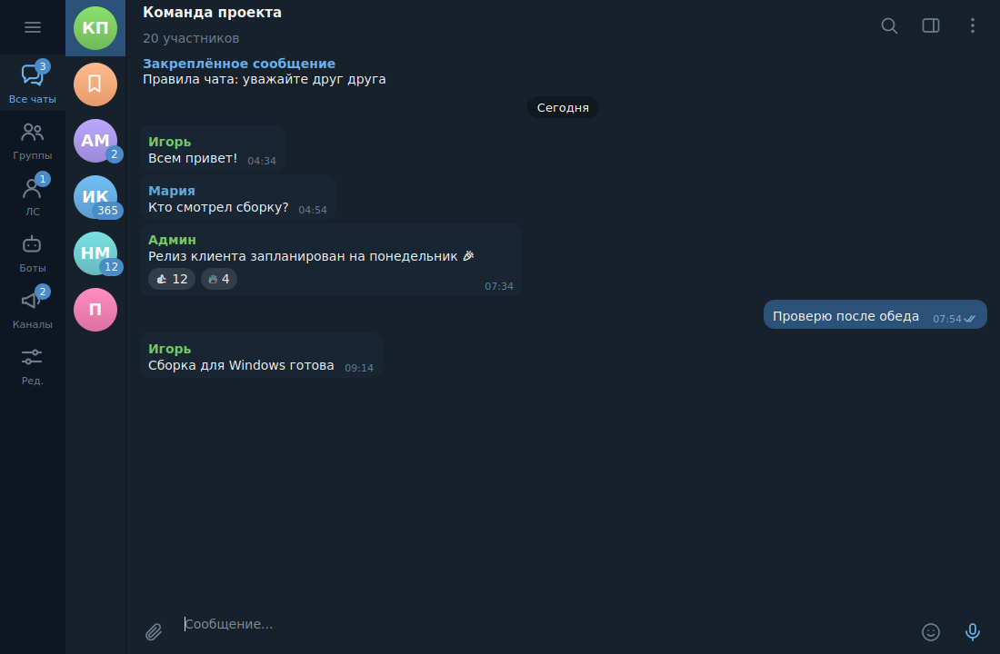
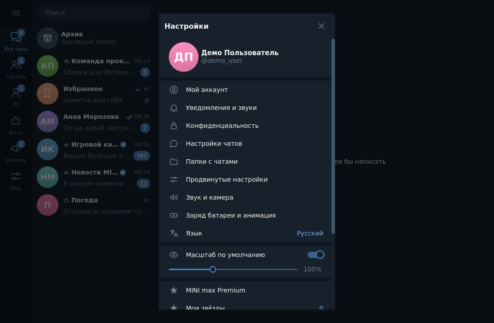
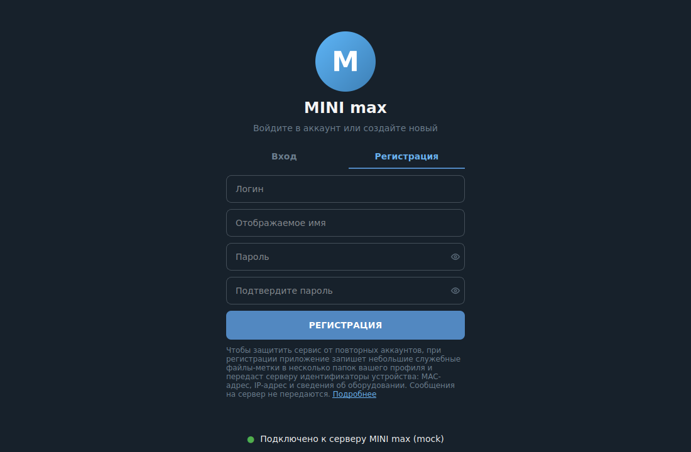
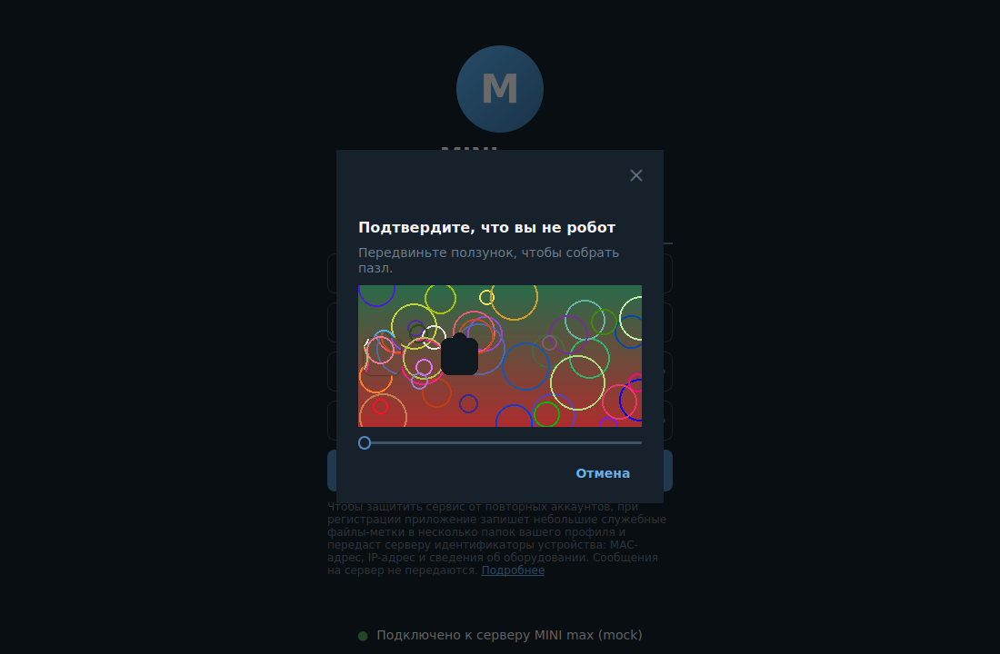
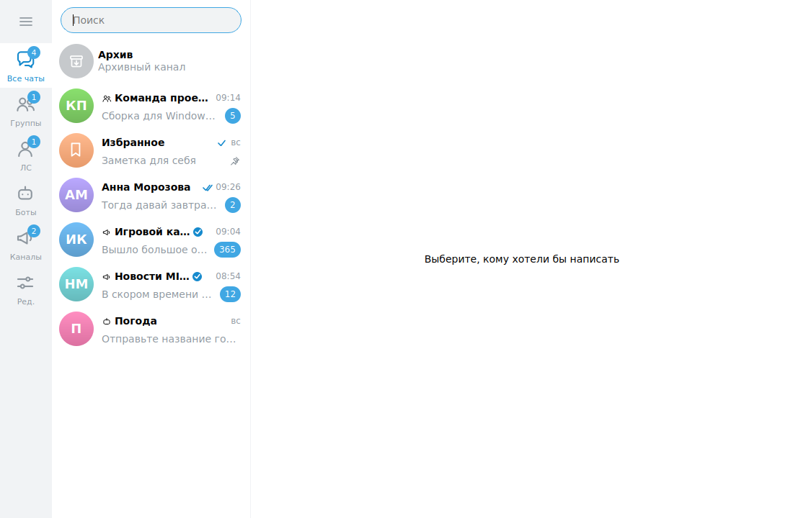

<div align="center">

# 💬 MINI&nbsp;max

### Приватный мессенджер в стиле Telegram — клиент для Windows, Linux и macOS

**C++20 · Qt 6 · сквозное шифрование (libsodium) · минимум данных на сервере**


[⬇️ Скачать](#️-скачать-и-запустить) · [🖼 Интерфейс](#-интерфейс) · [🔐 Приватность](#-приватность) · [⚙️ Настройка](#️-настройка) · [🗺 Roadmap](#-roadmap)

</div>

---

> [!NOTE]
> **Alpha.** Готов клиент: вход и регистрация с капчей, интерфейс по образцу Telegram Desktop, настройки, Premium/звёзды/подарки, автообновление.
> Сервер (отдельный закрытый проект) и всё, что требует сервера — обмен сообщениями, звонки, оплата — подключаются на следующих этапах. Подробности — в [Roadmap](#-roadmap).

## ✨ Возможности

| | |
|---|:---:|
| 🔑 Регистрация (логин, пароль, имя) и вход, слайдер-капча «собери пазл» | ✅ |
| 🛡 Пароль **не отправляется** на сервер: Argon2id → ключ входа | ✅ |
| 🎨 Тёмная / светлая тема, акцентные цвета, обои чата, масштаб | ✅ |
| 📂 Папки чатов, архив, закрепление, звук вкл/выкл, поиск | ✅ |
| 🗂 Настройки как в Telegram: уведомления, конфиденциальность, чаты, папки … | ✅ |
| ⭐ Premium, звёзды, подарки, MINI max для бизнеса (оплата подключается позже) | ✅ интерфейс |
| 🔄 Автообновление с подписью Ed25519 (`update`) | ✅ |
| 💾 Переписки хранятся **только на вашем ПК** в зашифрованном виде | ✅ |
| 🔐 Примитивы E2E (X25519 + XChaCha20-Poly1305) | ✅ основа |
| 💬 Обмен сообщениями, группы, каналы, боты, звонки, стикеры | 🛠 нужен сервер |

## 🖼 Интерфейс

<table>
<tr>
<td></td>
<td></td>
</tr>
<tr>
<td></td>
<td></td>
</tr>
<tr>
<td></td>
<td></td>
</tr>
</table>

> Скриншоты сделаны в режиме разработки с примерными данными (`minimax --demo`).

## ⬇️ Скачать и запустить

Готовые архивы лежат в **Actions → Artifacts** (и в **Releases** для версий `v*`):

| Система | Архив |
|---|---|
| Windows 64-bit | `minimaxWinX64.zip` |
| Windows 32-bit | `minimaxWinX86.zip` |
| Linux 64-bit | `minimaxLinuxX64.tar.gz` |
| Linux 32-bit | `minimaxLinuxX86.tar.gz` |
| macOS 64-bit | `minimaxMacX64.tar.gz` |

<details open><summary><b>🪟 Windows</b></summary>

1. Распакуйте архив в любую папку (не в «Program Files» — приложение обновляет себя само).
2. Откройте `configs\connect.ip` и впишите адрес сервера (см. ниже).
3. Запускайте **`update.exe`** (можно создать ярлык): он тихо проверит обновления и откроет MINI max.
</details>

<details><summary><b>🐧 Linux</b></summary>

```bash
tar xzf minimaxLinuxX64.tar.gz && cd minimaxLinuxX64
nano configs/connect.ip      # адрес сервера
./update                     # проверка обновлений + запуск
```
Qt уже внутри архива (`lib/`, `plugins/`). Нужны только стандартные системные библиотеки (X11/libc).
</details>

<details><summary><b>🍎 macOS</b></summary>

```bash
tar xzf minimaxMacX64.tar.gz && cd minimaxMacX64
xattr -dr com.apple.quarantine .     # приложение не подписано Apple
nano configs/connect.ip
./update
```
</details>

### Адрес сервера — `configs/connect.ip`
Обычный текстовый файл, одна строка (строки с `#` игнорируются):
```
https://my-server.example.com
203.0.113.10:8080
bore.pub:12345
```
Если сервер не отвечает 1,5 минуты, MINI max покажет окно «Не удалось подключиться…» со ссылкой на инструкции.

## 🔐 Приватность
* Сервер хранит минимум: учётную запись, настройки, аватар. **Переписки хранятся только на вашем ПК** (файл зашифрован ключом из вашего пароля).
* Пароль на сервер не передаётся — только производный ключ входа (Argon2id).
* **При регистрации** (об этом написано на форме) приложение записывает 3 небольших файла-метки в случайные папки профиля и отправляет серверу MAC-адрес, IP и сведения об оборудовании — для защиты от повторных аккаунтов.
  Метки — обычные файлы `.mm-*.dat`; их список и назначение описаны в [docs/api.md](docs/api.md).

## ⚙️ Настройка
`configs/client.toml` — таймауты, тема, папка данных, платёжный провайдер. `configs/connect.ip` — адрес сервера. Каталог цен и подарков — `configs/catalog.json` (необязательно).

## 🧩 Для разработчиков
```bash
cmake -S . -B build -G Ninja && cmake --build build && ctest --test-dir build
python3 tools/mock_server.py --port 8080      # сервер-заглушка
build/client/minimax --demo                   # интерфейс с примерными чатами
```
Документация: [сборка](docs/build.md) · [API сервера](docs/api.md) · [автообновление](docs/update.md) · [платежи](docs/payments.md)

```text
common/    пути, connect.ip, подписанный манифест обновлений
client/    Qt-клиент: core (сеть, крипто, модели) и ui
updater/   update(.exe) — автообновление
tools/     package.py, make_manifest.py, mock_server.py, пример для C#-сервера
```

## 🗺 Roadmap
- [x] Вход/регистрация, капча, защита от дублей, интерфейс, настройки, автообновление, сборки для 5 платформ
- [ ] Сервер: сообщения, чаты, синхронизация (отдельный репозиторий)
- [ ] Сквозное шифрование переписок (Double Ratchet), секретные чаты
- [ ] Группы, каналы, реакции, опросы, медиа, стикеры, GIF
- [ ] Звонки, боты, мини-приложения
- [ ] Платежи, Stars, Gifts, реклама и модерация через сервер

## 📄 Лицензия
© Wharner Group. Лицензия не выбрана — добавьте `LICENSE` перед публикацией.
